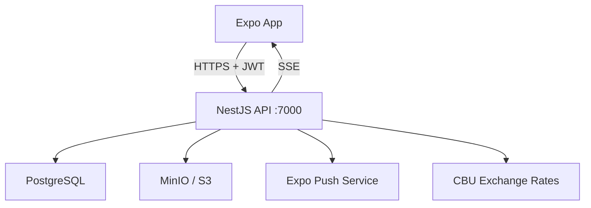

# Expo POS App — Comprehensive Backend Integration Guide

> **Backend**: NestJS + Prisma + PostgreSQL + MinIO + Expo Push Notifications
> **Mobile App**: Expo (React Native) with Axios
> **API Base**: `http://<host>:7000` — Swagger docs at `/api/docs`

---

## Table of Contents

1. [Architecture Overview](#1-architecture-overview)
2. [Authentication & Sessions](#2-authentication--sessions)
3. [Role-Based Access Control](#3-role-based-access-control)
4. [API Client Setup](#4-api-client-setup)
5. [Type System](#5-type-system)
6. [API Reference — All Endpoints](#6-api-reference--all-endpoints)
7. [Sales — POS Checkout Flow](#7-sales--pos-checkout-flow)
8. [Image Upload Pattern](#8-image-upload-pattern)
9. [Push Notifications](#9-push-notifications)
10. [SSE — Real-Time Session Events](#10-sse--real-time-session-events)
11. [Exchange Rates & Currency](#11-exchange-rates--currency)
12. [Reports & Analytics](#12-reports--analytics)
13. [Error Handling](#13-error-handling)
14. [Recommended App Architecture](#14-recommended-app-architecture)

---

## 1. Architecture Overview

The backend is a **multi-tenant** POS system where:

- Every `Tenant` represents a business/store
- Each tenant has `Branch`es, `User`s, `Product`s, `Inventory`, etc.
- **Data isolation** is enforced by `tenantId` — extracted from the JWT automatically
- Users never see data from other tenants



### Global Guards (applied to ALL routes)

| Guard | Purpose |
|---|---|
| `JwtAuthGuard` | Validates Bearer token, extracts user from JWT |
| `RolesGuard` | Checks `@Roles()` decorator against `user.role` |
| `SubscriptionGuard` | Blocks expired/cancelled subscriptions |
| `ThrottlerGuard` | Rate limits: 60 requests / 60 seconds |

### Validation

All request bodies are validated with `class-validator`:
- `whitelist: true` — unknown properties are stripped
- `forbidNonWhitelisted: true` — unknown properties throw 400
- `transform: true` — auto-transforms strings to numbers etc.

---

## 2. Authentication & Sessions

### Registration Flow

```
POST /auth/register  (Public)
Body: { phone, password, fullName, tenantName, language? }
Returns: { accessToken, user }
```

What happens server-side:
1. Creates a `Tenant` with a 30-day trial subscription
2. Creates a `User` with role `owner`
3. Creates a `Session` record
4. Returns a signed JWT containing `{ sub, phone, role, tenantId, branchId, sessionId }`

### Login Flow

```
POST /auth/login  (Public)
Body: { phone, password }
Returns: { accessToken, user }
```

### JWT Payload Shape

```typescript
interface JwtPayload {
  sub: string;        // userId
  phone: string;
  role: UserRole;     // 'super_admin' | 'owner' | 'seller'
  tenantId: string;
  branchId: string | null;
  sessionId: string;
  iat: number;
  exp: number;
}
```

### Session Management

Every login creates a `Session` record in the database. The backend checks that the session is **not revoked** on every authenticated request. This enables:

- **Remote logout**: An owner can see all active sessions and revoke any one
- **Logout all**: Revokes every session for the user
- **SSE force-logout**: The app receives a real-time event when its session is revoked

| Endpoint | Method | Description |
|---|---|---|
| `/auth/profile` | GET | Current user + tenant + branch |
| `/auth/logout` | POST | Blacklist current session |
| `/auth/logout-all` | POST | Revoke all sessions |
| `/auth/sessions` | GET | List active sessions (with `isCurrent` flag) |
| `/auth/sessions/:id` | DELETE | Revoke a specific session |
| `/auth/events` | SSE | Real-time session/user events |

### Token Storage (Mobile)

Tokens are stored using `expo-secure-store` via the `storage` helper:

```typescript
import { authApi } from '@/api';

const { accessToken, user } = await authApi.login({ phone, password });
// Token is auto-stored in SecureStore by authApi.login()
```

---

## 3. Role-Based Access Control

| Role | Scope |
|---|---|
| `super_admin` | Full system access (tenants, plans) |
| `owner` | Full access within their tenant |
| `seller` | Limited: can view products, branches; cannot manage users or transactions |

### Permission Matrix

| Resource | seller | owner | super_admin |
|---|:---:|:---:|:---:|
| Products (CRUD) | ✅ | ✅ | ✅ |
| Branches (list/view) | ✅ | ✅ | ✅ |
| Branches (create/edit/delete) | ❌ | ✅ | ✅ |
| Users (CRUD) | ❌ | ✅ | ✅ |
| Users (change own language) | ✅ | ✅ | ✅ |
| Transactions (create/edit/delete) | ❌ | ✅ | ✅ |
| Transactions (list/view) | ✅ | ✅ | ✅ |
| Reports | ❌ | ✅ | ✅ |
| Tenants (CRUD) | ❌ | ❌ | ✅ |
| Subscription Plans (CRUD) | ❌ | ❌ | ✅ |

---

## 4. API Client Setup

The Axios client is pre-configured in `api/client.ts`:

```typescript
import api, { getApiErrorMessage, setOnUnauthorized } from '@/api';

// In your AuthProvider:
setOnUnauthorized(() => {
  // Navigate to login screen
  router.replace('/login');
});
```

**Key behaviors**:
- Auto-attaches `Bearer <token>` from SecureStore
- Sets `User-Agent` from device info
- 401 responses auto-clear token and trigger `onUnauthorized` callback
- Network errors return `"Network error. Check your connection."`

---

## 5. Type System

All types are in `types/index.ts`. Import them via the path alias:

```typescript
import type { Product, CreateProductPayload, InventoryStatus } from '@/types';
```

### Key Type Categories

| Category | Types |
|---|---|
| **Enums** | `UserRole`, `Currency`, `PaymentMethod`, `TransactionType`, `PartyTransactionType`, `InventoryMovementType`, `SaleStatus`, `SubscriptionStatus`, `ReportFormat`, `ExportReportType` |
| **Auth** | `LoginPayload`, `RegisterPayload`, `AuthResponse`, `JwtPayload`, `Session`, `SseEvent` |
| **Models** | `User`, `Tenant`, `Branch`, `Product`, `Inventory`, `InventoryMovement`, `Client`, `Supplier`, `Transaction`, `ClientTransaction`, `SupplierTransaction`, `Sale`, `SaleItem`, `ExchangeRate`, `Report` |
| **Payloads** | `Create*Payload`, `Update*Payload` for each model |
| **Sales** | `CreateSalePayload`, `SaleItemPayload`, `SaleListQuery`, `SaleSummary` |
| **Reports** | `FinancialSummary`, `TransactionsByDayItem`, `CategoryBreakdownItem`, `InventoryReport`, `PartyBalanceSummary` |

---

## 6. API Reference — All Endpoints

### 6.1 Auth (`api/auth.ts`)

| Method | Endpoint | Auth | Description |
|---|---|:---:|---|
| POST | `/auth/register` | ❌ | Register owner + tenant |
| POST | `/auth/login` | ❌ | Login |
| GET | `/auth/profile` | ✅ | Get current user profile |
| POST | `/auth/logout` | ✅ | Logout current session |
| POST | `/auth/logout-all` | ✅ | Revoke all sessions |
| GET | `/auth/sessions` | ✅ | List active sessions |
| DELETE | `/auth/sessions/:id` | ✅ | Revoke specific session |
| SSE | `/auth/events` | ✅ | Real-time session events |

### 6.2 Users (`api/users.ts`)

| Method | Endpoint | Roles | Description |
|---|---|:---:|---|
| PATCH | `/users/me/language` | all | Change own language |
| POST | `/users` | owner, sa | Create user |
| GET | `/users?role=` | owner, sa | List users |
| GET | `/users/:id` | owner, sa | Get user by ID |
| PATCH | `/users/:id` | owner, sa | Update user |
| DELETE | `/users/:id` | owner, sa | Deactivate user |

### 6.3 Branches (`api/branches.ts`)

| Method | Endpoint | Roles | Description |
|---|---|:---:|---|
| POST | `/branches` | owner, sa | Create branch |
| GET | `/branches` | all | List branches |
| GET | `/branches/:id` | all | Get branch |
| PATCH | `/branches/:id` | owner, sa | Update branch |
| DELETE | `/branches/:id` | owner, sa | Deactivate branch |

### 6.4 Products (`api/products.ts`)

| Method | Endpoint | Description |
|---|---|---|
| POST | `/products` | Create product (multipart — with optional image) |
| GET | `/products?search=` | List products (includes inventory + inventoryStatus) |
| GET | `/products/:id` | Get product detail |
| PATCH | `/products/:id` | Update product |
| DELETE | `/products/:id` | Soft-delete (isActive → false) |
| POST | `/products/:id/image` | Upload/replace image (multipart) |
| DELETE | `/products/:id/image` | Remove image |

> [!NOTE]
> - Creating a product with `quantity` and `minQuantity` auto-creates an `Inventory` record.
> - **PATCH `/products/:id`** now also accepts `quantity` and `minQuantity` — they are synced to the linked `Inventory` row in the same transaction.
> - The response for create, update, and getById includes `inventoryStatus: 'in-stock' | 'low-stock'`.

### 6.5 Inventory (`api/inventory.ts`)

| Method | Endpoint | Description |
|---|---|---|
| POST | `/inventory` | Create inventory record |
| GET | `/inventory` | List all inventory |
| GET | `/inventory/low-stock` | Low-stock items only |
| GET | `/inventory/movements?inventoryId=` | Movement history |
| GET | `/inventory/:id` | Detail + last 20 movements |
| PATCH | `/inventory/:id` | Adjust (auto-creates movement + low-stock notification) |
| DELETE | `/inventory/:id` | Delete inventory record |

> [!IMPORTANT]
> When you PATCH an inventory's `quantity`, the backend:
> 1. Creates an `InventoryMovement` record (type: `in` / `out` / `adjustment`)
> 2. Checks if the product is now below `minQuantity`
> 3. Sends an Expo push notification to the tenant owner if low-stock

### 6.6 Clients & Suppliers (`api/partners.ts`)

**Clients:**

| Method | Endpoint | Description |
|---|---|---|
| POST | `/clients` | Create client |
| GET | `/clients?search=&sortBy=&order=` | List (sort by `createdAt`, `clientTransAmount`, `alphabetic`) |
| GET | `/clients/:id` | Get client |
| PATCH | `/clients/:id` | Update |
| DELETE | `/clients/:id` | Delete |
| GET | `/clients/export/excel` | Export as Excel |

**Suppliers:** Same pattern at `/suppliers` (no `sortBy`/`order` params).

### 6.7 Transactions (`api/transactions.ts`)

| Method | Endpoint | Roles | Description |
|---|---|:---:|---|
| POST | `/transactions` | owner, sa | Create income/expense |
| GET | `/transactions?branchId=&type=` | all | List |
| GET | `/transactions/:id` | all | Detail |
| PATCH | `/transactions/:id` | owner, sa | Update |
| DELETE | `/transactions/:id` | owner, sa | Delete |

### 6.8 Client/Supplier Transactions (`api/party-transactions.ts`)

**Client Transactions:**

| Method | Endpoint | Description |
|---|---|---|
| POST | `/client-transactions` | Record payment (income) or debt (outcome) |
| GET | `/client-transactions?clientId=` | List |
| GET | `/client-transactions/:id` | Detail |
| GET | `/client-transactions/balance/:clientId` | Balance summary (UZS + USD) |
| DELETE | `/client-transactions/:id` | Delete |
| GET | `/client-transactions/export/excel?clientId=` | Export |

**Supplier Transactions:** Same pattern at `/supplier-transactions`.

> [!TIP]
> The `type` field semantics:
> - `income`: The party pays **us** (client payment or supplier refund)
> - `outcome`: **We** owe them or pay them (client debt or supplier payment)

> [!NOTE]
> `ClientTransaction` now has a `saleId` field. Entries auto-created by a debt sale will have this populated, allowing you to link back to the original `Sale` record.

### 6.13 Sales (`api/sales.ts`)

| Method | Endpoint | Description |
|---|---|---|
| POST | `/sales` | Create a sale (anonymous or client-linked) |
| GET | `/sales?clientId=&branchId=&status=&from=&to=` | List sales with filters |
| GET | `/sales/summary?branchId=` | Today's revenue, cost, profit, debt totals |
| GET | `/sales/:id` | Full detail — items, client, linked client transactions |
| PATCH | `/sales/:id/cancel` | Cancel sale — restores stock + reverses client debt |

**Status values:** `completed` · `debt` · `cancelled`

### 6.9 Categories (`api/catalog.ts`)

Five separate CRUD APIs with identical structure:

| Base Path | Model |
|---|---|
| `/categories` | Product categories |
| `/brand-categories` | Brand categories |
| `/units` | Measurement units (kg, pcs, etc.) |
| `/expense-categories` | Expense classification |
| `/income-categories` | Income classification |

Each supports: `GET /`, `GET /:id`, `POST /`, `PATCH /:id`, `DELETE /:id`

### 6.10 Reports (`api/reports.ts`)

| Method | Endpoint | Description |
|---|---|---|
| GET | `/reports/financial-summary` | Income, expenses, net profit |
| GET | `/reports/transactions-by-day` | Daily breakdown |
| GET | `/reports/expenses-by-category` | Expenses grouped by category |
| GET | `/reports/income-by-category` | Income grouped by category |
| GET | `/reports/inventory` | Stock values + low-stock |
| GET | `/reports/client-balances` | All client balances |
| GET | `/reports/supplier-balances` | All supplier balances |
| GET | `/reports/top-products?limit=` | Active products |
| POST | `/reports/export` | Generate PDF/Excel/CSV report |
| GET | `/reports/exports` | List exported reports |
| GET | `/reports/exports/:id/url` | Get download URL |
| DELETE | `/reports/exports/:id` | Delete export |

All analytics endpoints accept optional `?branchId=&from=&to=` query params.

### 6.11 Exchange Rates (`api/exchange-rates.ts`)

| Method | Endpoint | Description |
|---|---|---|
| GET | `/exchange-rates/today` | Today's rate (auto-fetches from CBU) |
| GET | `/exchange-rates/latest` | Most recent stored rate |
| GET | `/exchange-rates/convert?amount=&from=&to=` | Convert USD↔UZS |
| GET | `/exchange-rates` | All historical rates |

### 6.12 Notifications (`api/notifications.ts`)

| Method | Endpoint | Description |
|---|---|---|
| POST | `/notifications/register-token` | Register Expo push token |
| DELETE | `/notifications/remove-token` | Remove push token |
| POST | `/notifications/send` | Send to specific tokens |
| POST | `/notifications/send/user/:userId` | Send to a user |
| POST | `/notifications/send/tenant` | Send to all tenant users |
| POST | `/notifications/receipts` | Check delivery receipts |

---

## 7. Sales — POS Checkout Flow

### How it works end-to-end

```
POST /sales
```

The backend performs all of the following **atomically in one database transaction**:

1. Validates each product exists, is active, and has sufficient inventory
2. Creates the `Sale` record + `SaleItem[]` with snapshotted prices
3. Decrements `Inventory.quantity` per item
4. Creates an `InventoryMovement` (type: `out`) per item
5. If `clientId` is provided **and** `debtAmount > 0`, auto-creates a `ClientTransaction` (type: `outcome`, linked via `saleId`)
6. After commit — fires low-stock push notification asynchronously if any item is now below `minQuantity`

### Walk-in (anonymous) sale — cash, fully paid

```typescript
import { salesApi } from '@/api';

const sale = await salesApi.create({
  items: [
    { productId: 'uuid-1', quantity: 2 },          // uses product.sellingPrice
    { productId: 'uuid-2', quantity: 1, unitPrice: 85000 }, // price override
  ],
  paymentMethod: 'cash',
  currency: 'UZS',
  paidAmount: 999000,   // equals total → status: 'completed'
});
```

### Client sale — partial payment (debt)

```typescript
const sale = await salesApi.create({
  items: [{ productId: 'uuid-1', quantity: 3 }],
  clientId: 'client-uuid',    // required for debt sales
  paymentMethod: 'transfer',
  currency: 'UZS',
  paidAmount: 50000,          // less than total → status: 'debt'
  discount: 5000,
  note: 'Wholesale deal',
});
// Automatically creates ClientTransaction { type: 'outcome', amount: debtAmount, saleId: sale.id }
```

> [!IMPORTANT]
> If `paidAmount < totalAmount` and **no `clientId`** is provided, the backend returns `400 Bad Request`.
> Debt sales always require a named client.

### Cancel a sale

```typescript
const cancelled = await salesApi.cancel(saleId);
// Inventory is restored for all items.
// If the sale had debt, an offsetting ClientTransaction { type: 'income' } is created to zero it out.
```

### Dashboard summary

```typescript
const summary = await salesApi.getSummary();
// {
//   date: '2026-05-13',
//   salesCount: 12,
//   totalRevenue: 4500000,
//   totalCost: 3100000,
//   grossProfit: 1400000,
//   totalDiscount: 50000,
//   totalDebt: 200000
// }
```

### React Query hooks

```typescript
import { useQuery, useMutation, useQueryClient } from '@tanstack/react-query';
import { salesApi } from '@/api';
import type { CreateSalePayload, SaleListQuery } from '@/types';

export const useSales = (filters?: SaleListQuery) =>
  useQuery({
    queryKey: ['sales', filters],
    queryFn: () => salesApi.getAll(filters),
  });

export const useSaleSummary = (branchId?: string) =>
  useQuery({
    queryKey: ['sales-summary', branchId],
    queryFn: () => salesApi.getSummary(branchId),
  });

export const useCreateSale = () => {
  const queryClient = useQueryClient();
  return useMutation({
    mutationFn: (data: CreateSalePayload) => salesApi.create(data),
    onSuccess: () => {
      // Invalidate sales list, summary, inventory, and client transactions
      queryClient.invalidateQueries({ queryKey: ['sales'] });
      queryClient.invalidateQueries({ queryKey: ['sales-summary'] });
      queryClient.invalidateQueries({ queryKey: ['inventory'] });
      queryClient.invalidateQueries({ queryKey: ['client-transactions'] });
    },
  });
};

export const useCancelSale = () => {
  const queryClient = useQueryClient();
  return useMutation({
    mutationFn: (id: string) => salesApi.cancel(id),
    onSuccess: () => {
      queryClient.invalidateQueries({ queryKey: ['sales'] });
      queryClient.invalidateQueries({ queryKey: ['inventory'] });
      queryClient.invalidateQueries({ queryKey: ['client-transactions'] });
    },
  });
};
```

### Profit calculation per sale

Both `unitPrice` and `costPrice` are snapshotted on each `SaleItem` at the moment of the sale. This means profit is always accurate even if prices change later:

```typescript
function calcSaleProfit(sale: Sale): number {
  const itemProfit = (sale.items ?? []).reduce((sum, item) => {
    return sum + (item.unitPrice - item.costPrice) * item.quantity;
  }, 0);
  return itemProfit - sale.discount;
}
```

---

## 8. Image Upload Pattern

React Native uses `FormData` with `{ uri, name, type }` objects:

```typescript
import * as ImagePicker from 'expo-image-picker';
import { productsApi } from '@/api';

const result = await ImagePicker.launchImageLibraryAsync({
  mediaTypes: ImagePicker.MediaTypeOptions.Images,
  quality: 0.8,
});

if (!result.canceled) {
  const asset = result.assets[0];
  await productsApi.uploadImage(productId, {
    uri: asset.uri,
    name: asset.fileName ?? 'photo.jpg',
    type: asset.mimeType ?? 'image/jpeg',
  });
}
```

**Constraints:**
- Max file size: **50 MB**
- Supported formats: `jpeg`, `png`, `webp`, `gif`
- Images are stored in MinIO and served via presigned URLs

---

## 9. Push Notifications

### Registration

```typescript
import * as Notifications from 'expo-notifications';
import { notificationsApi } from '@/api';

const { data: token } = await Notifications.getExpoPushTokenAsync();
await notificationsApi.registerToken(token);
```

### Auto Low-Stock Alerts

The backend automatically sends push notifications to the **tenant owner** when:
- An inventory adjustment causes `quantity <= minQuantity`
- Messages are localized based on the owner's `language` setting

### Cleanup on Logout

```typescript
await notificationsApi.removeToken();
await authApi.logout();
```

---

## 10. SSE — Real-Time Session Events

The backend emits Server-Sent Events for session invalidation:

```typescript
// Event types:
type SseEventType = 'session_revoked' | 'user_deactivated';

// In your AuthProvider:
useEffect(() => {
  const es = new EventSource(`${API_URL}/auth/events`);
  es.onmessage = (event) => {
    const data: SseEvent = JSON.parse(event.data);
    if (data.type === 'session_revoked' || data.type === 'user_deactivated') {
      // Force logout
      authApi.logout();
      router.replace('/login');
    }
  };
  return () => es.close();
}, []);
```

> [!WARNING]
> Native `EventSource` doesn't support `Authorization` headers. You may need
> `react-native-sse` or a polyfill library that supports custom headers.

---

## 11. Exchange Rates & Currency

The system supports dual-currency (UZS + USD):
- Products have a `currency` field
- Transactions track amounts in their stated currency
- Client/supplier balances are tracked **separately** for UZS and USD
- Exchange rates are fetched daily from the Central Bank of Uzbekistan (CBU)

```typescript
import { exchangeRatesApi } from '@/api';

// Get today's rate
const rate = await exchangeRatesApi.getToday();
console.log(`1 USD = ${rate.usdToUzs} UZS`);

// Convert
const result = await exchangeRatesApi.convert(100, 'USD', 'UZS');
console.log(`$100 = ${result.result} UZS`);
```

---

## 12. Reports & Analytics

### Financial Dashboard

```typescript
import { reportsApi } from '@/api';

// Overall summary
const summary = await reportsApi.financialSummary({
  from: '2026-01-01',
  to: '2026-12-31',
});
// { totalIncome, totalExpenses, netProfit, transactionCount }

// Daily chart data
const daily = await reportsApi.transactionsByDay({ from: '2026-05-01', to: '2026-05-31' });
// [{ date, count, income, expenses, net }, ...]

// Category breakdown for pie charts
const expenses = await reportsApi.expensesByCategory();
// [{ id, name, totalAmount, transactionCount }, ...]
```

### Report Export

```typescript
// Generate a PDF report
const report = await reportsApi.exportReport({
  reportType: 'financial-summary',
  format: 'pdf',
  from: '2026-01-01',
  to: '2026-12-31',
});

// Get download URL
const { url } = await reportsApi.getExportUrl(report.id);
// Use Linking.openURL(url) or expo-file-system to download
```

---

## 13. Error Handling

### Standard Error Shape

```typescript
interface ApiError {
  statusCode: number;
  message: string | string[];  // Can be array for validation errors
  error: string;               // e.g. "Bad Request", "Unauthorized"
}
```

### Common Status Codes

| Code | Meaning |
|---|---|
| 400 | Validation error (check `message` array) |
| 401 | Invalid/expired token or revoked session |
| 403 | Role not authorized for this action |
| 404 | Resource not found |
| 409 | Conflict (e.g., phone already registered) |
| 429 | Rate limited (60 req / 60s) |

### Error Extraction Helper

```typescript
import { getApiErrorMessage } from '@/api';

try {
  await productsApi.create(data);
} catch (error) {
  const message = getApiErrorMessage(error);
  Alert.alert('Error', message);
}
```

---

## 14. Recommended App Architecture

### Project Structure

```
pos-mobile-app/
├── api/                    # ← API services (complete)
│   ├── index.ts            # Barrel export
│   ├── client.ts           # Axios instance
│   ├── auth.ts
│   ├── users.ts
│   ├── branches.ts
│   ├── products.ts
│   ├── inventory.ts
│   ├── catalog.ts          # categories, brands, units, expense/income cats
│   ├── partners.ts         # clients, suppliers
│   ├── transactions.ts
│   ├── party-transactions.ts  # client/supplier transactions
│   ├── sales.ts            # ← POS sales (NEW)
│   ├── reports.ts
│   ├── exchange-rates.ts
│   └── notifications.ts
├── types/
│   └── index.ts            # ← All TypeScript types (includes Sale, SaleItem, SaleStatus)
├── app/                    # Expo Router screens
│   ├── (auth)/             # Login, Register
│   ├── (tabs)/             # Main tab navigator
│   │   ├── dashboard.tsx
│   │   ├── products.tsx
│   │   ├── sales.tsx       # ← POS checkout screen (NEW)
│   │   ├── transactions.tsx
│   │   └── settings.tsx
│   └── _layout.tsx
├── components/             # Reusable UI components
├── hooks/                  # Custom hooks
└── theme/                  # Design tokens
```

### State Management

```typescript
// Recommended: React Query (TanStack Query) for server state
import { useQuery, useMutation } from '@tanstack/react-query';
import { productsApi } from '@/api';

export const useProducts = (search?: string) =>
  useQuery({
    queryKey: ['products', search],
    queryFn: () => productsApi.getAll(search),
  });

export const useCreateProduct = () =>
  useMutation({
    mutationFn: (data: CreateProductPayload) => productsApi.create(data),
    onSuccess: () => queryClient.invalidateQueries({ queryKey: ['products'] }),
  });
```

### Offline-First Considerations

For a POS app that must work during connectivity drops:

1. **React Query Persistence**: Use `@tanstack/query-async-storage-persister` to cache product lists and inventory in local storage
2. **Optimistic Updates**: Queue inventory adjustments locally and sync when online
3. **SQLite**: For heavy offline needs, consider `expo-sqlite` to mirror critical product/inventory data
4. **Network Detection**: Use `@react-native-community/netinfo` to show offline badges

---

*Last updated 2026-05-13. Reflects: Sales module (Sale + SaleItem), inventory sync on product update, ClientTransaction.saleId link. Verify against the live Swagger docs at `/api/docs`.*
